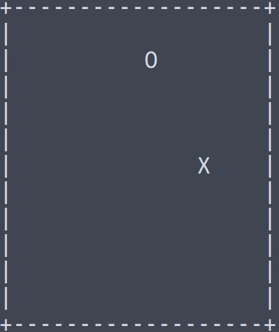

# shnake

Feeling your eyelids droop during that never-ending meeting? Or maybe you're on your server, bored out of your mind?

Shnake is here for you!

```
curl https://raw.githubusercontent.com/psykulsk/shnake/master/shnake.sh -o shnake.sh && \
bash shnake.sh
```

```
usage: shnake.sh [-c cols ] [-r rows] [-s speed]
  -h display help
  -c cols specify game area cols. Make sure it's not higher then the actual terminal's width. 
  -r rows specify game area rows. Make sure it's not higher then the actual terminal's height.
  -s speed specify snake speed. Value from 1-10.
```

Requires `bash --version` >= 4.0. **Warning**, MacOS is distributed with bash 3 by default. Check the [instructions](#upgrading-bash-on-macos) on how to upgrade it.

### Other bash games
* [tetri.sh](https://github.com/psykulsk/tetri.sh)

### Demo


### Upgrading bash on MacOS

* Install a new version of bash using brew: `brew install bash`
* Add `/opt/homebrew/bin/bash` to  `/etc/shells`
* Set is as default with `chsh -s /usr/local/bin/bash`
